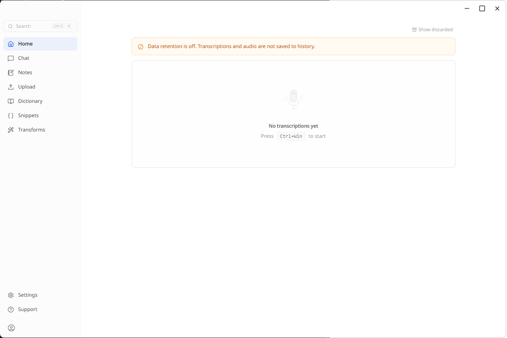
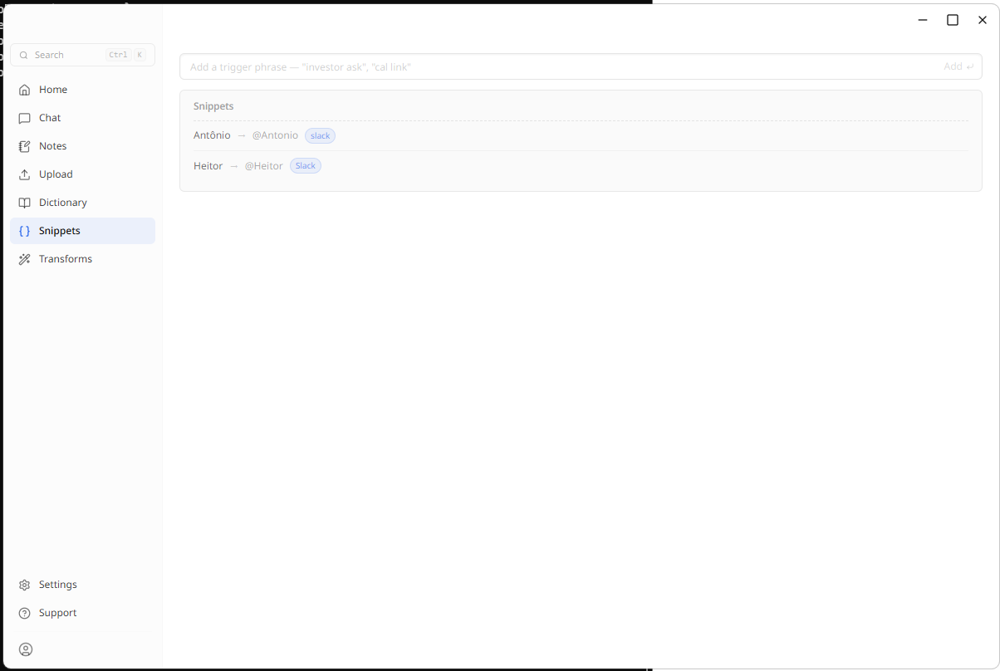
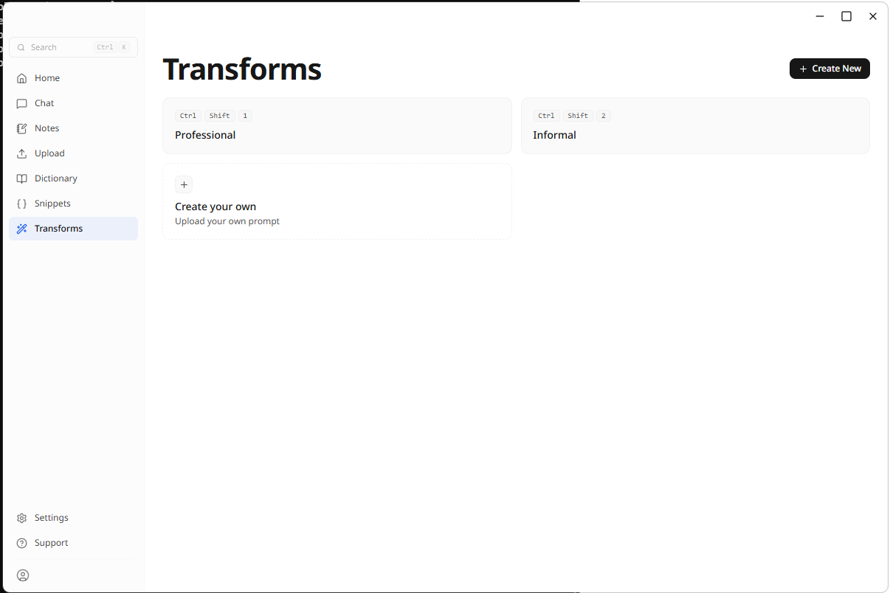
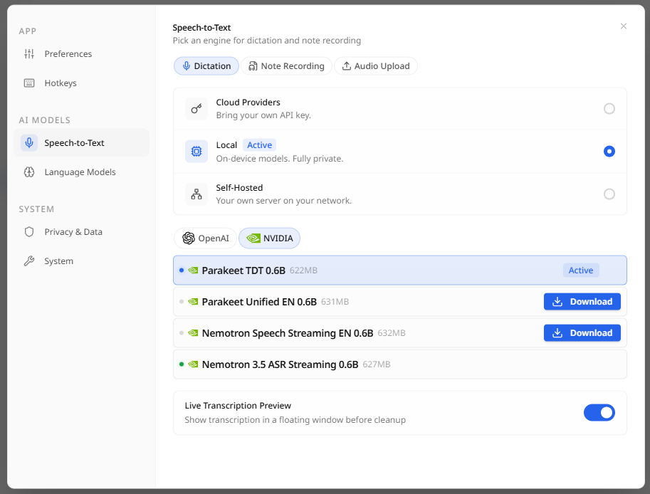
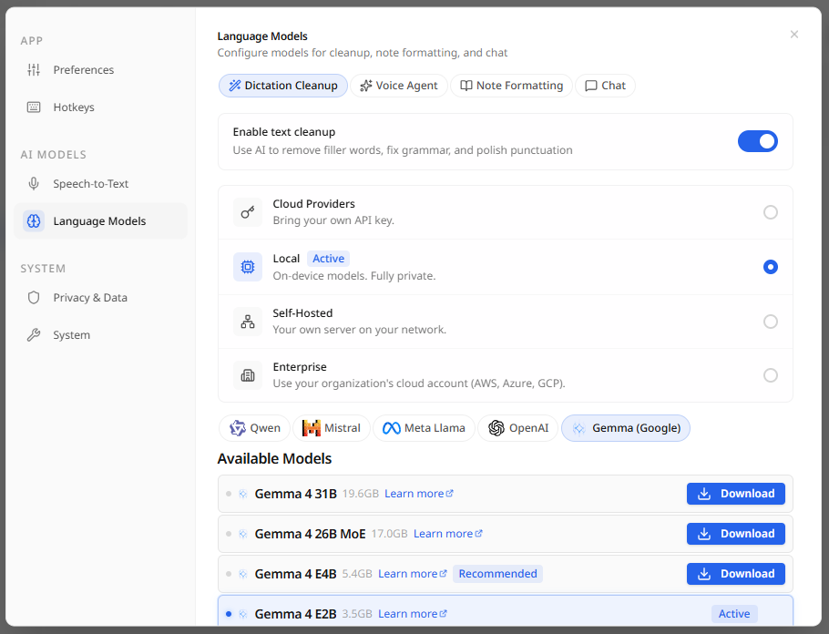
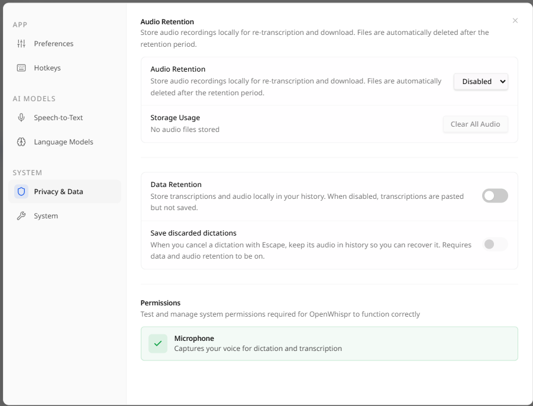
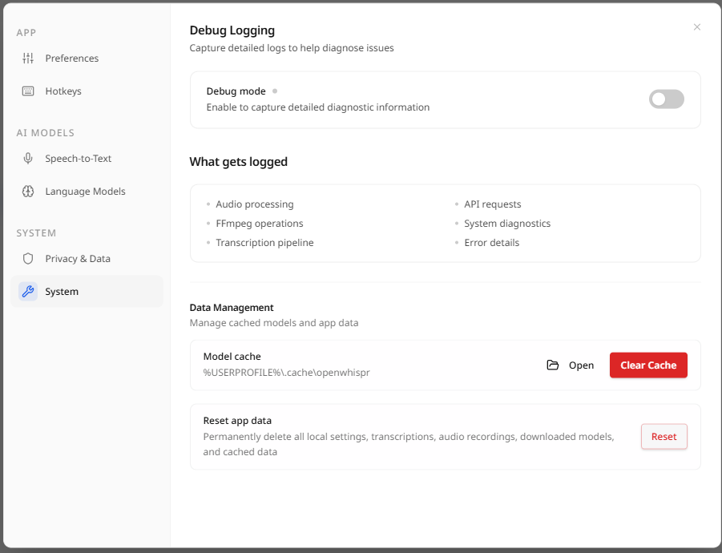

<p align="center">
  
</p>

<h1 align="center">EktosWhispr — Offline Fork</h1>

<p align="center">
  
  
  
</p>

<p align="center">
  Offline-first fork of <a href="https://github.com/OpenWhispr/openwhispr"><strong>OpenWhispr</strong></a>.<br/>
  All cloud-only features removed. New capabilities added for fully local operation.
</p>

---

## What is this?

This repository is a fork of the open-source dictation app [**OpenWhispr**](https://github.com/OpenWhispr/openwhispr).

The upstream project supports both local and cloud processing. This fork removes all cloud-only features and adds capabilities designed for environments where data must stay on the device. It is an independent branch — no upstream merges are planned and the projects evolve separately.

---

## Differences from upstream OpenWhispr

### Features added in this fork

| Feature | Description |
|---|---|
| 🎙️ **Meeting audio recording** | Microphone and system audio are mixed and saved as a compressed WebM/Opus file (~14 MB/hour) at the end of each meeting. Audio is stored locally in `userData/meeting-audio/`. |
| ▶️ **Meeting audio playback** | A player bar appears in the transcript view whenever a recording exists. |
| ⏱️ **Timestamped transcript lines** | Every transcript segment displays a clickable `MM:SS` timestamp. Clicking it seeks the audio player to that moment. Timestamps are preserved when the note is reopened. |
| 🔄 **Re-transcription** | A "Re-transcribe" button processes the saved audio again through whisper with precise per-word timestamps. A progress bar updates per 30-second chunk. |
| 🗑️ **Cascade audio delete** | Deleting a meeting note also deletes its audio file from disk. |
| 📌 **App-scoped snippets** | Text expansion snippets can be restricted to a specific application — they only trigger when that app is the active foreground window. |
| 🖥️ **Active-app detection** | The main process continuously tracks the foreground application and exposes it to hotkey and snippet rules via IPC (`activeAppCapture.js`). |
| 🔀 **Local text transforms** | Dictated text can be post-processed by on-device transform rules (rewrite, format, route) before being pasted, without any cloud call. |
| 📅 **Meeting default title** | New manual meetings are titled `Meeting YYYY-MM-DD HH:MM` (local time) instead of "New note". |

### Features removed from upstream

| Feature | Reason |
|---|---|
| ❌ OpenWhispr Cloud sync | Requires cloud account and external servers |
| ❌ Corti clinical routing | EU-only cloud LLM gateway |
| ❌ Tinfoil confidential transcription | External attestation service |
| ❌ Referral system | Cloud-only growth feature |
| ❌ Google Calendar auto-join | Requires OAuth to Google |
| ❌ Note cloud sharing | Requires cloud account |

### Behaviour differences

| Behaviour | Upstream | This fork |
|---|---|---|
| Opening a meeting note | Shows Notes tab | Shows Transcript tab directly |
| Same-speaker consecutive bubbles | Speaker label appears on hover | No hover label (avoids blocking timestamp clicks) |
| Meeting transcription response format | `json` only | `json` for live, `verbose_json` for re-transcription |

---

## Screenshots

<table>
  <tr>
    <td align="center"><strong>Home — dictation history</strong></td>
    <td align="center"><strong>Snippets — app-scoped text expansion</strong></td>
    <td align="center"><strong>Transforms — local post-processing rules</strong></td>
  </tr>
  <tr>
    <td></td>
    <td></td>
    <td></td>
  </tr>
  <tr>
    <td align="center"><strong>Settings — Speech-to-Text (NVIDIA Parakeet)</strong></td>
    <td align="center"><strong>Settings — Local language models</strong></td>
    <td align="center"><strong>Settings — Privacy & data retention</strong></td>
  </tr>
  <tr>
    <td></td>
    <td></td>
    <td></td>
  </tr>
  <tr>
    <td align="center"><strong>Settings — Debug logging & data management</strong></td>
    <td></td>
    <td></td>
  </tr>
  <tr>
    <td></td>
    <td></td>
    <td></td>
  </tr>
</table>

---

## Features (full list)

- **Voice dictation** — global hotkey to dictate into any app with automatic pasting
- **AI agent** — talk to GPT-5, Claude, Gemini, Groq, or local models with a named voice assistant
- **Voice agent hotkey** — dedicated hotkey that sends your dictation straight to your AI agent as a command, no wake word needed
- **Meeting transcription** — auto-detect Zoom, Teams, and FaceTime calls with live speaker diarization and voice fingerprinting
- **Meeting audio recording & playback** — each meeting is saved locally; play it back with click-to-seek timestamps; re-transcribe anytime
- **Local speaker diarization** — on-device speaker labelling with voice fingerprint recognition across meetings
- **Notes** — create, organize, and search notes with folders and semantic search
- **App-scoped snippets** — text expansion that activates only for a specific application
- **Active-app detection** — foreground application tracked for context-aware automation
- **Local text transforms** — post-transcription rules applied entirely on-device
- **Local models only** — transcription (whisper.cpp / NVIDIA Parakeet), AI reasoning (llama.cpp), speaker diarization, and semantic search all run on-device

---

## Download

Pre-built installers are published on each release:

| Platform | File |
|---|---|
| Windows | `.exe` (NSIS installer) |
| macOS Intel | `.dmg` (x64) |
| macOS Apple Silicon | `.dmg` (arm64) |
| Linux | `.AppImage`, `.deb`, `.rpm` |

→ [Latest release](https://github.com/chelcomp/ektoswhispr-offline/releases/latest)

## Quick start

```bash
git clone https://github.com/chelcomp/ektoswhispr-offline.git
cd ektoswhispr-offline
npm install
npm run dev
```

Requires Node.js 24. If you have `nvm`: `nvm use` picks the pinned version from `.nvmrc`.

On first run, whisper.cpp and NVIDIA Parakeet binaries are downloaded automatically for your platform. Local models (whisper, llama.cpp, Qdrant, MiniLM) are downloaded on demand from the app's Settings screen.

---

## Tech stack

React 19 · TypeScript · Tailwind CSS v4 · Electron 41 · better-sqlite3 · whisper.cpp · sherpa-onnx (NVIDIA Parakeet) · shadcn/ui · FFmpeg

---

## Contributing

See [`.github/CONTRIBUTING.md`](.github/CONTRIBUTING.md).

For changes that would benefit the upstream project, please also consider opening a PR at [OpenWhispr/openwhispr](https://github.com/OpenWhispr/openwhispr).

## License

[MIT](LICENSE) — free for personal and commercial use.

## Acknowledgments

- **[OpenWhispr](https://github.com/OpenWhispr/openwhispr)** — the upstream project this fork is based on
- **[OpenAI Whisper](https://github.com/openai/whisper)** — speech recognition model
- **[whisper.cpp](https://github.com/ggerganov/whisper.cpp)** — high-performance C++ implementation for local processing
- **[NVIDIA Parakeet](https://huggingface.co/nvidia/parakeet-tdt-0.6b-v3)** — fast multilingual ASR model
- **[sherpa-onnx](https://github.com/k2-fsa/sherpa-onnx)** — cross-platform ONNX runtime for Parakeet inference
- **[llama.cpp](https://github.com/ggerganov/llama.cpp)** — local LLM inference for AI text processing
- **[Electron](https://www.electronjs.org/)** — cross-platform desktop framework
- **[React](https://react.dev/)** — UI component library
- **[shadcn/ui](https://ui.shadcn.com/)** — accessible components built on Radix primitives
